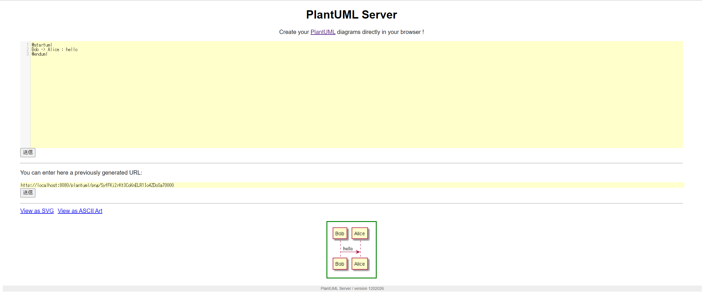
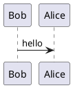
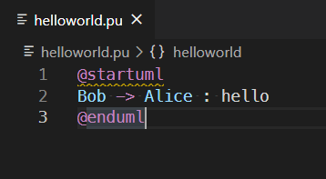
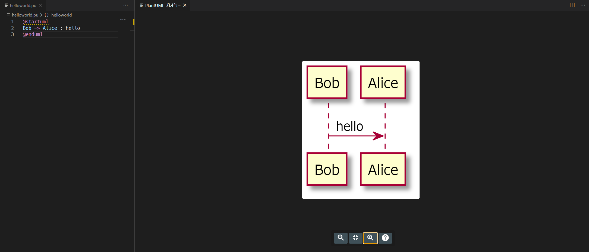

# 💎PlantUMLをVS Code上で利用してみる

PlantUMLは様々なダイアグラムをコードで記述する事ができるソフトウェア。

今回はそんなPlantUMLをVS Code上で利用できる拡張機能を利用して環境構築してみる。

## 今回利用する環境

- Windows 10
- VS Code 1.52.1
- vscode-plantuml 2.14.1

## 各種ウェブサイト

[PlantUML](http://plantuml.com/)

PlantUMLの公式サイト。

しっかりしたリファレンスがあるので記述方法は公式を参照すれば問題ないです。

[VS Code PlantUML拡張](https://marketplace.visualstudio.com/items?itemName=jebbs.plantuml)

VS CodeでPlantUMLを利用できるようにする拡張機能。
VS Code上でPlantUMLの記法で作成したテキストファイルのプレビューができるようになります。

[plantuml/plantuml-server](https://github.com/plantuml/plantuml-server)

VS Code拡張機能の標準設定ではレンダリング方法`Local render`が設定されていますが、PlantUMLServerを立てて利用した方がレンダリングは早いようです。
ですので本記事ではPlantUMLServerを利用した環境構築について説明します。

別にサーバ立てるまでもなくという場合は、`Local render`でjavaと[GraphViz](https://plantuml.com/ja/graphviz-dot)をインストールすれば利用できるようになります。

`Local render`と`PlantUMLServer`でどれくらい描画に違いがあるかは[About Render](https://github.com/qjebbs/vscode-plantuml/blob/master/README.md#about-render)に記載があります。

```log
Local: 6 documents, 9 digrams, 14 files exported in 24.149 seconds
PlantUMLServer: 6 documents, 9 digrams, 14 files exported in 1.564 seconds
```

[PlantUML オンラインサーバ](http://www.plantuml.com/plantuml/uml/SyfFKj2rKt3CoKnELR1Io4ZDoSa70000)

本記事ではローカル環境にPlantUMLを利用できる環境構築を説明していますが、オンライン上でPlantUMLを利用できるサーバもあります。
とりあえずPlantUMLがどんなものかてっとり速く確認した場合に有用です。

## VS Codeのインストール

公式のセットアップガイドがあるのでそちらを参照して適宜インストールして下さい。

[SETUP Windows](https://code.visualstudio.com/docs/setup/windows)

## VScode+PlantUMLの環境構築

[vscode-plantuml](https://github.com/qjebbs/vscode-plantuml/blob/master/README.md)に`How to install`の記載があるため、こちらに従ってインストール作業を行う。

### vscode-plantumlのインストール

VS Codeに[PlantUML拡張](https://marketplace.visualstudio.com/items?itemName=jebbs.plantuml)をインストールする。

`ctrl+P`で開くコマンドパレットに`ext install plantuml`と入力して実行するとサイドバーで該当拡張機能が検索されるのでPlantUMLをインストール。

### PlantUML Server環境構築

今回、PlantUMLのレンダリング方法を`local render`ではなく`PlantUML Server`を利用してレンダリングするため。
`PlantUML Server`環境を構築する。

構築方法としては下記を参照する。

[PlantUML Server](https://github.com/plantuml/plantuml-server)

説明を読むと、普通にインストールするだけではなく、Dockerでの起動方法も記載されています。
まずはDockerを利用せずに環境構築してみます。

Requirementsは下記の記載があるので、インストールする。

- jre/jdk 1.6.0 or above
- apache maven 3.0.2 or above

#### jre/jdkのインストール

適宜、jre/jdkをインストールして下さい。

本記事では[OpenJDK](https://openjdk.java.net/)をインストールして環境変数`PATH` と `JAVA_HOME`を設定して利用しています。

#### mavenのインストール

[Apatch Maven](https://maven.apache.org/)のサイトからダウンロードしてインストールして下さい。

インストール方法は　[Installing Apache Maven](https://maven.apache.org/install.html)に記載があります。

### run the server

[How to run the server](https://github.com/plantuml/plantuml-server#how-to-run-the-server)

jdkのインストールとmavenのインストールが完了したのでPlantUMLサーバを起動してみます。

まずはvscode-plantumlのリポジトリを取得して配置。
配置したディレクトリに移動して、`mvn jetty:run`を実行。

```pwsh
git clone https://github.com/plantuml/plantuml-server.git

cd plantuml-server

mvn jetty:run
```

`mvn jetty:run`を実行すると初回は色々と処理が走りますが。
最終的に下記のメッセージが表示されればPlantUMLサーバが [http://localhost:8080/plantuml](http://localhost:8080/plantuml)　に立ち上がっています。

```log
[INFO] Started Jetty Server
[INFO] Starting scanner at interval of 5 seconds.
```

ブラウザで[http://localhost:8080/plantuml](http://localhost:8080/plantuml)にアクセスするとPlantUMLServerが立ち上がっているのが確認できます。



PlantUMLサーバを停止する場合は`Ctrl+C Y`で停止できます。

### dockerで起動してみる

上記で普通に環境構築して起動しましたが、Dockerを利用している場合は更に手軽に環境が構築できます。

[How to run the server with Docker
](https://github.com/plantuml/plantuml-server#how-to-run-the-server-with-docker)

上記にDockerでの起動方法について説明があります。
jetty or tomcat container　とそれぞれ用意されているようです。
今回はjettyで起動してみます。

下記このコマンドを実行すると`PlantUMLServer`が起動します。
この場合は、ブラウザでアクセスするのは[http://localhost:8080](http://localhost:8080)になります。

```pwsh
docker run -d -p 8080:8080 plantuml/plantuml-server:jetty
```

### VS Codeの拡張設定

[Use PlantUML Server as Render](https://github.com/qjebbs/vscode-plantuml/blob/master/README.md#use-plantuml-server-as-render)

標準の設定が`local render`に設定されているため下記の設定を行い、`PlantUMLServer render`に変更する。
（dockerの場合は　`http://localhost:8080`　にする）

```json
"plantuml.server": "http://localhost:8080/plantuml/",
"plantuml.render": "PlantUMLServer",
```

## PlantUML HelloWorls

`helloworld.pu`というファイルを作成して下記を入力





この状態でコマンドパレットから`PlantUML:Preview Current Diagram` もしくは　`ALT+D` でプレビューが表示されます。



## ファイルの拡張子について

上記の例では拡張子をpuにしていますが、サポートしている拡張子としては下記に記載があります。

[Supported Formats](https://github.com/qjebbs/vscode-plantuml#supported-formats)

## PlantUMLの記法について

公式サイトにドキュメントが用意されているのでここらへんを参照すれば問題ない。

[pdf guide](http://plantuml.com/ja/guide)
[Hitchhiker's Guide](https://crashedmind.github.io/PlantUMLHitchhikersGuide/)

## 総評

PlantUMLはこなれて使いこなせるまでは、結構道のりが長いツールかと思います。
そもそもUMLを上手に書くのが難しいのに、さらにそれをコードに落とし込むのもなれないと難しい。　というダブルパンチの状態に陥ったり。

なかなかとっつきづらいとは思いますが、使いこなせるとかなり強力なツールかと思います。
